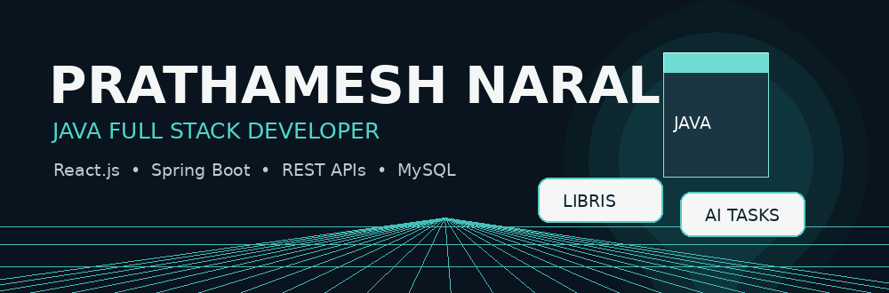

# 👋 Hi, I'm Prathamesh Narale

<p align="center">
  
</p>

<p align="center">
  <b>💻 Java Full Stack Developer • React.js • Spring Boot • REST APIs • MySQL</b>
</p>

<p align="center">
  
  
  
  
</p>

---

## 🧑‍💻 Who I Am

I'm a **Java Full Stack Developer** and Computer Engineering graduate who enjoys turning ideas into clean, practical and user-friendly applications.

```typescript
const prathameshNarale = {
  title: "Java Full Stack Developer",
  languages: ["Java", "JavaScript", "SQL", "TypeScript"],
  frontend: ["HTML5", "CSS3", "Bootstrap", "React.js"],
  backend: [
    "Spring Boot",
    "Spring MVC",
    "Spring Security",
    "Hibernate",
    "JDBC",
    "REST APIs",
    "JWT Authentication"
  ],
  databases: ["MySQL", "PostgreSQL"],
  tools: ["Git", "GitHub", "Maven", "Eclipse", "VS Code", "Postman", "Docker"],
  currentFocus: "Building scalable full-stack applications",
  openTo: [
    "Java Full Stack Developer Roles",
    "React Developer Roles",
    "Software Developer Opportunities",
    "Internships",
    "Collaboration"
  ]
};
```

---

# 🚀 Featured Projects

## 📚 Digital Library Management System — Libris

A modern full-stack digital library platform built with **React.js + Vite**, **Spring Boot REST API**, and **MySQL**.

### ✨ Features

- 🔐 Login / Registration
- 🛡️ Admin Dashboard
- 📚 Add / Edit / Delete Books
- 🔎 Search by title, author and ISBN
- 🏷️ Genre filtering
- 📖 Borrow / Return
- 🔖 Reserve unavailable books
- 💰 Automatic overdue fine calculation
- 📋 My Shelf
- 📞 Contact form
- 🎨 Modern responsive Libris UI

### 🛠️ Stack

`React.js` `Vite` `Java` `Spring Boot` `REST API` `Spring Data JPA` `Hibernate` `MySQL` `BCrypt` `Maven`

### 🔗 Project

**[📚 View Digital Library Repository](https://github.com/prathamesh-0045/DigitalLibrary)**

---

## 🎨 Real-Time Collaborative Whiteboard

Real-time collaborative drawing platform where authenticated users can create or join shared sessions and draw together.

**Tech:** React.js • TypeScript • Node.js • Express.js • Socket.IO • Keycloak • Fabric.js • Docker

### ✨ Highlights

- 🔐 Keycloak authentication
- 🧑‍🤝‍🧑 Collaborative sessions
- 🎨 Drawing tools and colors
- 🔄 Real-time synchronization
- 🖱️ Live collaborator cursors
- ↩️ Undo / Redo
- 🖼️ Image export
- 📄 PDF export
- 🐳 Docker setup

**[🎨 View Repository](https://github.com/prathamesh-0045/real-time-collaborative-whiteboard)**

---

## 🤖 AI Task Manager

Full-stack task management application with JWT authentication and AI-powered task generation.

**Tech:** React.js • Spring Boot • REST APIs • MySQL • Spring Security • JWT • BCrypt

### ✨ Highlights

- 🔐 JWT authentication
- 🤖 AI-powered task generation
- ➕ Create tasks
- ✏️ Update tasks
- 🗑️ Delete tasks
- 📊 Dashboard
- 🏷️ Priority and status management
- 📅 Due dates

**[🤖 View Repository](https://github.com/prathamesh-0045/AI-Task-Manager)**

---

## 🏥 Hospital Management System

A centralized web application for managing patients, doctors and appointments using a clean layered architecture.

**Tech:** React.js • Spring Boot • REST APIs • MySQL

**[🏥 View Repository](https://github.com/prathamesh-0045/Hospital-Management-System)**

---

# 🛠️ Tech Stack

| Category | Technologies |
|---|---|
| ☕ Languages | Java, JavaScript, SQL, TypeScript |
| 🎨 Frontend | HTML5, CSS3, Bootstrap, React.js |
| ⚙️ Backend | Spring Boot, Spring MVC, Spring Security, Hibernate, JDBC |
| 🔗 APIs | REST APIs, JWT Authentication |
| 🗄️ Database | MySQL, PostgreSQL |
| 🔧 Tools | Git, GitHub, Maven, Eclipse, VS Code, Postman |
| 🐳 DevOps | Docker, Docker Compose |

---

# 🏆 Certifications

- 🎓 GenAI Powered Data Analytics — TATA Forage
- ☕ IBM Java Programming Certificate
- 🗄️ IBM SQL & Relational Database Certificate
- 🌐 IBM HTML & CSS Certificate
- 💻 Java Full Stack Development — IT Vedant, Pimpri Pune

---

# 📊 GitHub Stats

<p align="center">
  
</p>

<p align="center">
  
</p>

---

# 🎯 Current Focus

```text
🚀 Advanced Spring Boot
🔐 Spring Security & JWT
⚛️ React.js
🗄️ SQL & Database Design
🧩 REST API Development
🏗️ Microservices
☁️ Cloud & Deployment
🤖 AI Integration
```

---

# 🤝 Let's Connect

<p align="center">
  <a href="https://github.com/prathamesh-0045">
    
  </a>
  <a href="https://www.linkedin.com/in/prathamesh-narale-479b14293/">
    
  </a>
</p>

---

<p align="center">
  <b>⭐ Build • Learn • Improve • Repeat ⭐</b>
</p>
