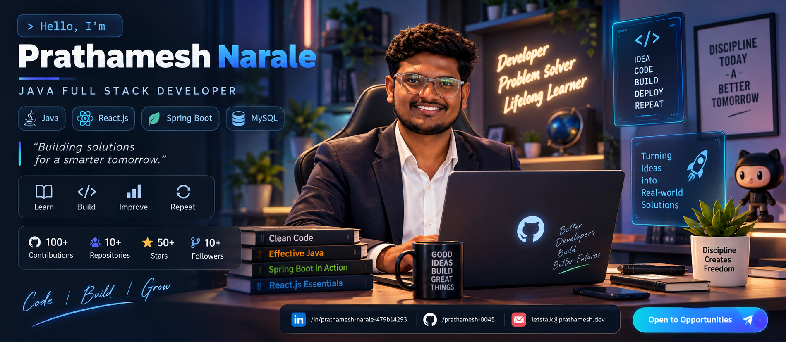

# 👋 Hi, I'm Prathamesh Narale

<p align="center">
  
</p>

<h2 align="center">☕ Java Full Stack Developer | 💻 Software Developer | 🚀 Problem Solver</h2>

<p align="center">
  <a href="https://github.com/prathamesh-0045">
    
  </a>
  <a href="https://www.linkedin.com/in/prathamesh-narale-479b14293/">
    
  </a>
</p>

---

## 🧑‍💻 About Me

I'm a **Computer Engineering graduate** focused on building reliable, scalable and user-friendly applications.

- 🔭 Building full-stack applications with **Java, Spring Boot and React.js**
- 🌱 Improving my skills in **Spring Security, REST APIs, SQL and system design**
- 🤖 Interested in **AI-powered applications and modern web development**
- 🧩 Enjoy solving problems and turning ideas into practical software
- 💼 Open to **Java Full Stack, React and Software Developer opportunities**

---

## ⚡ Tech Stack

### Languages
`Java` `JavaScript` `SQL` `TypeScript`

### Frontend
`HTML5` `CSS3` `Bootstrap` `React.js`

### Backend
`Spring Boot` `Spring MVC` `Spring Security` `Hibernate` `JDBC` `REST APIs` `JWT`

### Databases
`MySQL` `PostgreSQL`

### Tools
`Git` `GitHub` `Maven` `Eclipse` `VS Code` `Postman` `Docker`

---

## 🚀 Featured Projects

### 🎨 Real-Time Collaborative Whiteboard
Real-time collaborative drawing platform where authenticated users can create and join shared whiteboard sessions.

**Tech:** React.js, TypeScript, Node.js, Express.js, Socket.IO, Fabric.js, Keycloak, Docker

🔗 **[View Project](https://github.com/prathamesh-0045/real-time-collaborative-whiteboard)**

### 🗂️ AI Task Manager
Full-stack task management application with JWT authentication and AI-powered task generation.

**Tech:** React.js, Spring Boot, REST APIs, MySQL, JWT

🔗 **[View Project](https://github.com/prathamesh-0045/AI-Task-Manager)**

### 🏥 Hospital Management System
Web application for managing patients, doctors and appointments using a layered backend architecture.

**Tech:** React.js, Spring Boot, REST APIs, MySQL

🔗 **[View Project](https://github.com/prathamesh-0045/Hospital-Management-System)**

### 📚 Digital Library Management System
Full-stack digital library platform with book discovery, borrowing, reservations, admin management, automatic fines and user shelves.

**Tech:** React.js, Vite, Spring Boot, REST APIs, Spring Data JPA, MySQL

🔗 **[View Project](https://github.com/prathamesh-0045/DigitalLibrary)**

---

## 📊 GitHub Contributions

<p align="center">
  
  
</p>

### 🐍 Contribution Activity

<p align="center">
  
</p>

### 🧊 3D Contribution Graph

<p align="center">
  
</p>

---

## 🏆 Certifications

- **GenAI Powered Data Analytics** — TATA Forage
- **Java Programming** — IBM
- **SQL & Relational Database** — IBM
- **HTML & CSS** — IBM
- **Java Full Stack Development** — IT Vedant, Pimpri Pune

---

## 🎯 Current Focus

```text
Java + Spring Boot
        ↓
REST APIs + Spring Security
        ↓
MySQL + JPA/Hibernate
        ↓
React.js Frontend
        ↓
AI-powered Full Stack Applications
```

> **“Learn. Build. Improve. Repeat.”**

---

## 🤝 Let's Connect

<p align="center">
  <a href="https://github.com/prathamesh-0045">GitHub</a> •
  <a href="https://www.linkedin.com/in/prathamesh-narale-479b14293/">LinkedIn</a>
</p>

<p align="center">
  ⭐ Thanks for visiting my profile!
</p>
